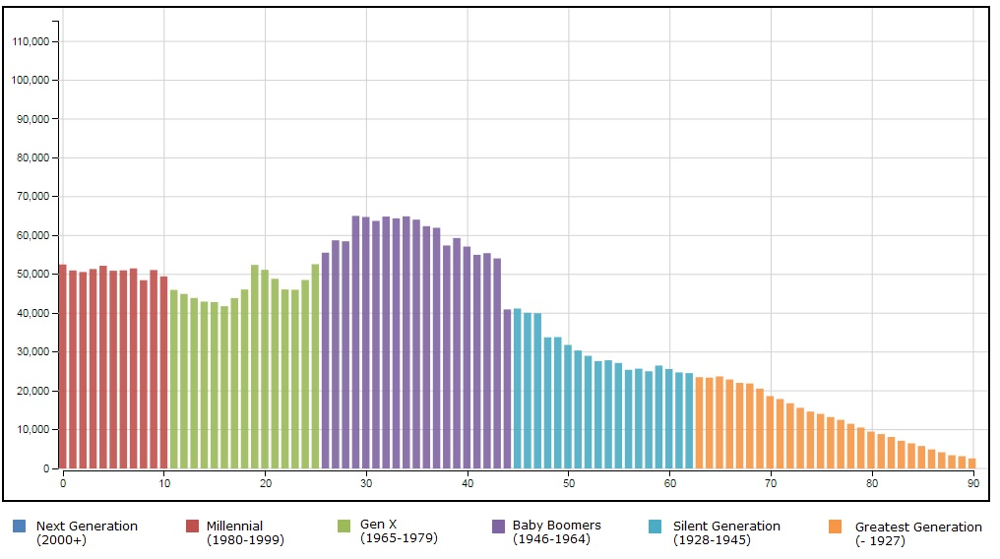

# Age-Animation-Bars
D3 Visualization of Colorado Single Year of Age over time.

  

A generational look at age for Colorado Counties.  Data from the Colorado State Demography Office: 10-20-2015.

Includes Population Data from 1990 - 2015, and Forecast Data from 2016 to 2050.

A stateful app.  Save a link of any county/year combination.  

Download animation (AVI), or save a PNG of a specific county/year.

Created with D3.js and the JQuery UI.
Screen Capture PNGs created with PhantomJS.
Animation AVI downloads created with PhantomJS and FFMPEG.